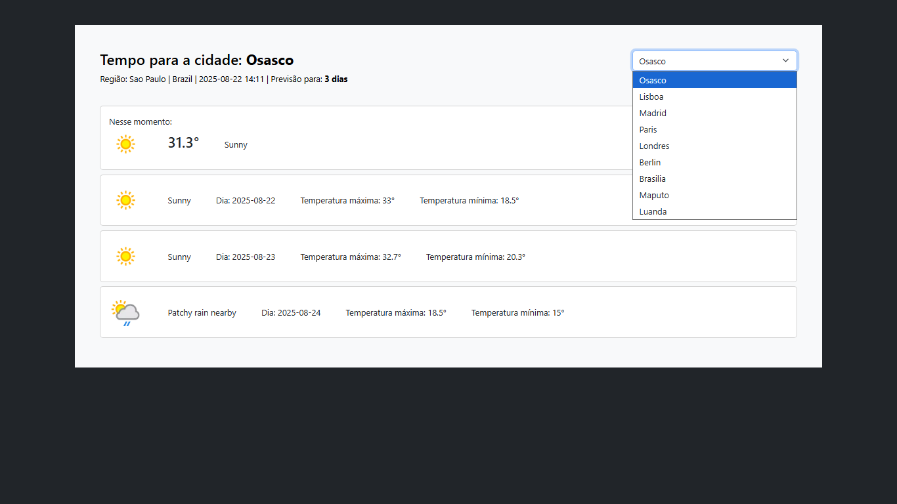

<h1 align="center"> 
    Weather-Api-With-PHP
</h1>
<p align="center">
  <a href="#-About">About</a>&nbsp;&nbsp;&nbsp;|&nbsp;&nbsp;&nbsp;
  <a href="#-Technologies">Technologies</a>&nbsp;&nbsp;&nbsp;|&nbsp;&nbsp;&nbsp;
  <a href="#-How to run">How to run</a>
</p>
<p align="center">
    
</p>

<h5 style="text-align: center"> Thank you for see !</h5>


## 📚 Sobre


Olá todo mundo, espero que estejam bem ! Nesse projeto para fixar os estudos em **`PHP`**, foi montado um sistema que consome um **_API_** de previsões do tempo que nos permite verificar desde temperaturas máximas, mínimas e previsões nos próximos dias de algumas cidades ao selecionar. Como fonte de conhecimento e estudo foi utilizado o canal do YouTube: **João Ribeiro** e o site: **w3schools** e **w3resource**, além da documentação da própria tecnologia. Nesse projeto para o consumo e a utilização da API utilizamos o site: **weatherapi**, utilizamos a **_API Key_** com o **_protocolo HTTP_** com **_array em formato JSON_**, com o **`PHP`** aprendemos a conhecer paths/caminhos/include dos arquivos, realizamos testes de requisição no **_`Thunder Client`_** no método do tipo **_GET_** no formato do body em cUrl para verificar o que é retornado, aprendemos a trabalhar com **_HEADERS_** no **_CURLOPT_HTTPHEADER_** que basicamente é onde contém informações do nosso perdido, testamos estruturas de respostas, mensagem de erro, condicicionais, **_status_** com retorno de **_success_** ou não, entendemos do que se trata a função **_json-decode_** que nos devolve um array associativo. Nos baseamos em estruturar os dados em 3 grupos location, **_current_** e **_forecast_**. Para estilização do nosso sistema utilizamos o **`Bootstrap`** e para apresentação da estrutura utilizamos o **`HTML`**, utilizamos o **`JavaScript`** para a parte de selecionar uma opção e atualizar os dados automaticamente isso com evento, captura de evento e captura de elemento.

Para ter acesso a conteúdo similares, acesse: [João Ribeiro](https://www.youtube.com/@JLDRPT), [w3schools](https://www.w3schools.com/php/default.asp) e [w3resource](https://www.w3resource.com/php/php-home.php#google_vignette).

## 🧪 Tecnologias

Esse projeto foi desenvolvido com as seguintes tecnologias:

- [HTML](https://developer.mozilla.org/en-US/docs/Web/HTML)
- [Bootstrap](https://getbootstrap.com/)
- [PHP](https://www.php.net/)
- [JavaScript](https://developer.mozilla.org/en-US/docs/Web/JavaScript)
- [Thunder Client](https://www.thunderclient.com/)

## 🚀 Como executar

Clone o projeto.

```bash
$ git clone https://github.com/arthursj/Weather-Api-With-PHP
$ cd Weather-Api-With-PHP
```

O app estará disponível no seu browser pelo endereço: http://localhost/Weather-Api-With-PHP.

## 📚 About

Olá todo mundo, espero que estejam bem ! Nesse projeto para fixar os estudos em **`PHP`**, foi montado um sistema que consome um **_API_** de previsões do tempo que nos permite verificar desde temperaturas máximas, mínimas e previsões nos próximos dias de algumas cidades ao selecionar. As a source of knowledge and study, the YouTube channel: **João Ribeiro** and the website: **w3schools** and **w3resource** were used, in addition to the documentation of the technology itself. In this project for the consumption and use of the API we used the website: **weatherapi**, we used the **_API Key_** with the **_HTTP_** protocol with **_array in JSON format_**, with **`PHP`** we learned to know the paths/paths/include of the files, we performed request tests in the **_`Thunder Client`_** in the **_GET_** type method in the body format in cUrl to verify what is returned, we learned to work with **_HEADERS_** in **_CURLOPT_HTTPHEADER_** which is basically where it contains information about our lost, we tested response structures, error messages, conditionals, **_status_** with return of **_success_** or not, we understood what the **_json-decode_** function is about which returns us an associative array. We based ourselves on structuring the data into 3 groups: location, **_current_** and **_forecast_**. To style our system we use **`Bootstrap`** and to present the structure we use **`HTML`**, we use **`JavaScript`** for the part of selecting an option and updating the data automatically with event, event capture and element capture.

To access similar content, visit: [João Ribeiro](https://www.youtube.com/@JLDRPT), [w3schools](https://www.w3schools.com/php/default.asp) and [w3resource](https://www.w3resource.com/php/php-home.php#google_vignette).

## 🧪 Technologies

This project was developed with the following technologies:

- [HTML](https://developer.mozilla.org/en-US/docs/Web/HTML)
- [Bootstrap](https://getbootstrap.com/)
- [PHP](https://www.php.net/)
- [JavaScript](https://developer.mozilla.org/en-US/docs/Web/JavaScript)
- [Thunder Client](https://www.thunderclient.com/)

## 🚀 How to run

Clone the project and access the folder and install the dependencies.

```bash
$ git clone https://github.com/arthursj/Weather-Api-With-PHP
$ cd Weather-Api-With-PHP
```

The app will be available in your browser at: http://localhost/Weather-Api-With-PHP.

--------------

Developed by :atom_symbol: [**Arthur Silva**]([arthursj (ArthurSilva) (github.com)](https://github.com/arthursj))